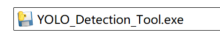
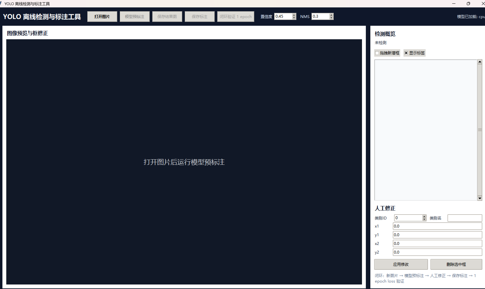
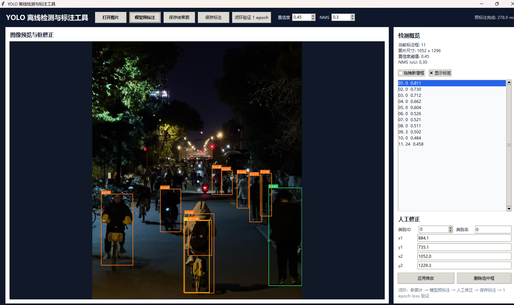
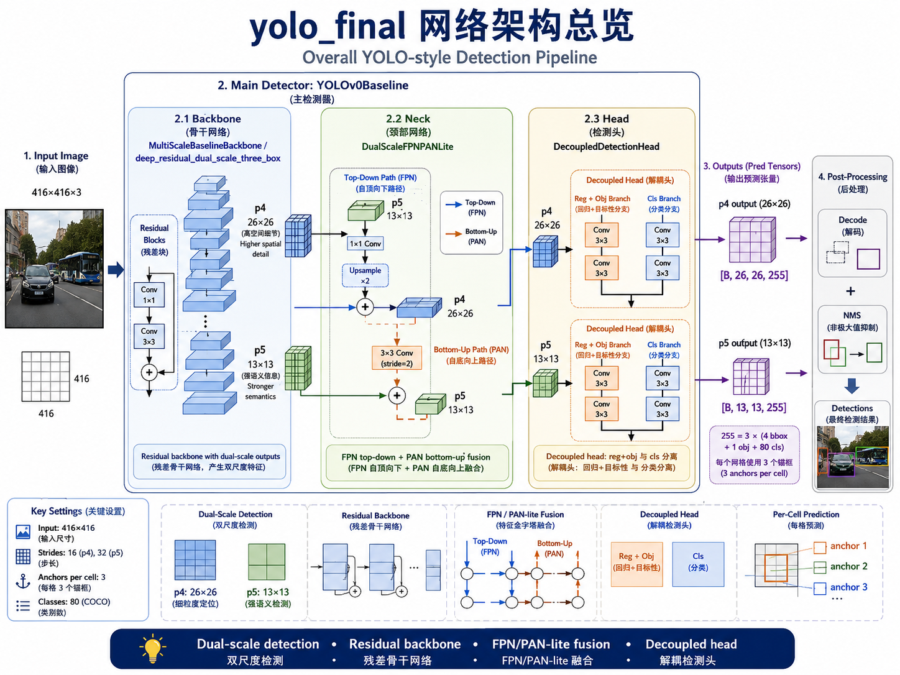
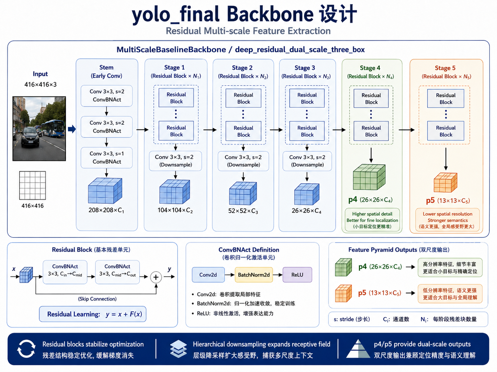
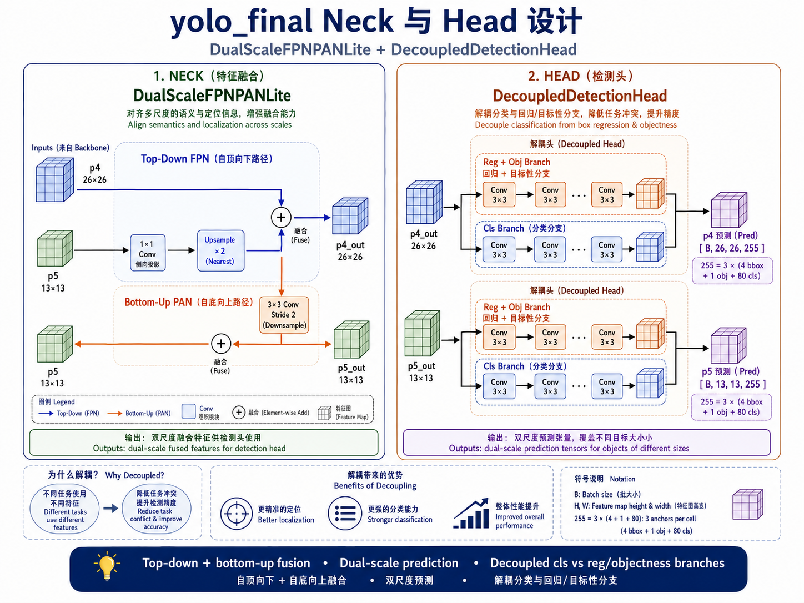
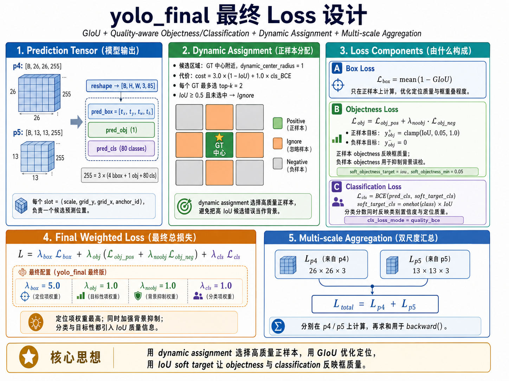
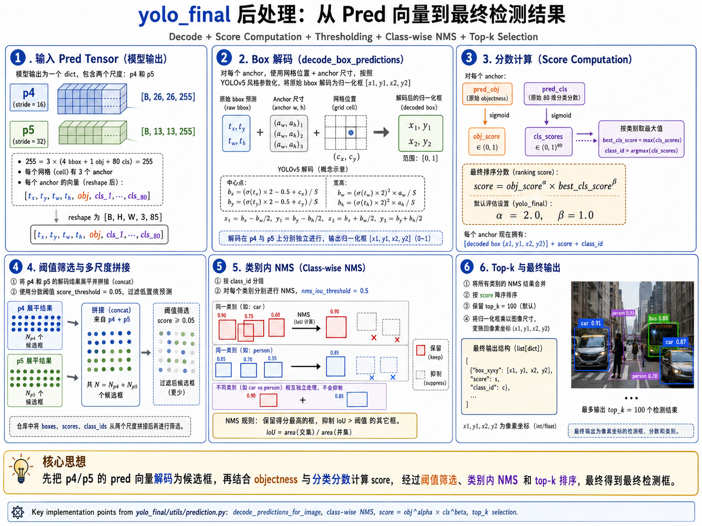

# YOLO Detection and Annotation

一个从零实现并完整实验验证的 YOLO 风格目标检测项目。项目覆盖了数据读取、模型结构设计、DDP 训练、COCO 官方评估、模型导出、量化验证、推理服务，以及最终的 Windows 离线检测与标注软件。

最终主线模型位于 `yolo_final/`，最终桌面软件基于该模型导出的 TorchScript 版本实现本地离线推理。

## 项目概览

本项目的目标不是简单调用现成 YOLO 框架，而是围绕目标检测训练流程自己实现核心模块：

- 自定义 YOLO-style detector：backbone、neck、head、prediction decode、NMS。
- COCO2017 数据加载与 `.pt` packed chunk 读取，降低训练时随机 IO 压力。
- 8 GPU DDP 正式训练脚本、分布式指标聚合和 TensorBoard 记录。
- GIoU box loss、IoU soft objectness/classification target、dynamic assignment。
- COCO 官方 AP 评估、离线 sweep、12/16 张结果可视化。
- TorchScript 导出、速度测试、INT8 量化实验。
- Windows 离线桌面软件：图片检测、人工修正、保存 YOLO 标注、闭环验证。

最终主线配置：

```text
yolo_final/configs/dual_scale_three_box_coco_only_noobj1_416_basic_aug_scale_jitter_50_lr7e4.toml
```

最终主线模型：

```text
deep_residual_dual_scale_three_box
input: 416 x 416
feature levels: p4, p5
anchors per scale: 3
classes: 80 COCO categories
```

完整 COCO val 指标：

| Metric | Value |
|---|---:|
| COCO AP | 0.192170 |
| AP50 | 0.310452 |
| AP75 | 0.200965 |
| AP small | 0.084709 |
| AP medium | 0.211648 |
| AP large | 0.261832 |
| AR100 | 0.351947 |

## Windows 离线检测与标注软件

最终软件是一个可以双击启动的 Windows 桌面工具。它不依赖服务器，不启动网页服务，直接在本机加载我们最优实验导出的 TorchScript 模型。

<p align="center">
  
</p>

软件支持完整闭环：

```text
新图片 -> 模型预标注 -> 人工修正 -> 保存 YOLO 标注 -> 1 epoch loss 验证
```

主界面如下：

<p align="center">
  
</p>

模型预标注和人工修正示例：

<p align="center">
  
</p>

### 下载

软件压缩包体积约 259 MB，包含 TorchScript 推理模型和用于闭环验证的 `best.pth`。由于模型文件超过普通 GitHub 文件大小限制，建议通过 GitHub Release 下载：

```text
Releases -> yolo_windows_desktop_v2_closed_loop_fixed3.zip
```

如果你是在项目服务器上获取，当前生成物路径为：

```text
yolo_final/desktop_app_dist/yolo_windows_desktop_v2_closed_loop_fixed3.zip
```

### 运行

解压后进入软件根目录：

```powershell
cd yolo_windows_desktop
pip install -r requirements_windows.txt
.\run_yolo_desktop.bat
```

如果已经构建出 exe，则运行：

```powershell
.\dist\YOLO_Detection_Tool\YOLO_Detection_Tool.exe
```

注意：分发时不要只复制单个 `.exe`，应整体复制：

```text
dist/YOLO_Detection_Tool/
```

该目录包含模型、配置、类别映射和闭环验证所需代码。

### 软件功能

- 打开任意本地图片。
- 使用最终 TorchScript 模型进行预标注。
- 默认置信度阈值 `0.45`，NMS IoU 阈值 `0.30`。
- 右侧列表查看预测框、类别和置信度。
- 手动修改类别、坐标，删除错误框。
- 在图像上拖拽新增框。
- 保存带框结果图。
- 保存 YOLO txt 标注。
- 使用新标注数据本地训练验证 1 epoch，并输出 loss 曲线与验证报告。

保存结果默认在：

```text
desktop_app_annotations/
  images/
  labels/
  visualizations/
  closed_loop_verify/
```

## 模型结构

最终模型采用 YOLO-style detection pipeline：

```text
image -> residual multi-scale backbone -> FPN/PAN-lite neck -> decoupled detection heads
      -> p4/p5 prediction tensors -> decode -> score -> threshold -> class-wise NMS
```

<p align="center">
  
</p>

核心设置：

| Component | Final Design |
|---|---|
| Backbone | `MultiScaleBaselineBackbone` / `deep_residual_dual_scale_three_box` |
| Neck | `DualScaleFPNPANLite` |
| Head | `DecoupledDetectionHead` |
| Feature levels | `p4`, `p5` |
| Output shapes | `p4: [B, 26, 26, 255]`, `p5: [B, 13, 13, 255]` |
| Per-anchor vector | `[tx, ty, tw, th, obj, cls_1, ..., cls_80]` |
| Box parameterization | YOLOv5-style decoding |

### Backbone

Backbone 使用多 stage 卷积下采样和残差块，从 416 输入图像中提取双尺度特征：

- `p4`: 26 x 26，空间分辨率更高，更有利于较小目标定位。
- `p5`: 13 x 13，语义更强，更有利于中大目标识别。

<p align="center">
  
</p>

### Neck and Head

Neck 使用轻量 FPN/PAN：

- FPN 自顶向下传递高层语义。
- PAN 自底向上传递定位信息。
- p4/p5 融合后分别进入检测头。

Head 使用 decoupled design：

- 回归和 objectness 分支关注位置与目标性。
- 分类分支关注类别语义。
- 减少分类、定位、目标性之间的任务冲突。

<p align="center">
  
</p>

## Loss and Assignment

最终 loss 由三个核心部分组成：

```text
L_total = L_p4 + L_p5

L_scale = lambda_box * L_box
        + lambda_obj * (L_obj_pos + lambda_noobj * L_obj_neg)
        + lambda_cls * L_cls
```

最终权重：

```text
lambda_box = 5.0
lambda_obj = 1.0
lambda_noobj = 1.0
lambda_cls = 1.0
```

正样本分配采用 `dynamic_cost`：

```text
cost = 3.0 * (1 - IoU) + 1.0 * cls_BCE
dynamic_topk = 2
dynamic_center_radius = 1
dynamic_ignore_iou = 0.5
```

也就是说，模型会围绕 GT 中心区域，从当前预测质量和分类代价中动态选择正样本，而不是只依赖固定网格或固定 anchor。

<p align="center">
  
</p>

## Prediction to Detection

模型输出不是直接的检测框，而是 p4/p5 两个尺度上的 prediction tensors。后处理流程为：

1. 将 `[B, H, W, 255]` reshape 为 `[B, H, W, 3, 85]`。
2. 对 box 参数进行 YOLOv5-style decode。
3. 对 objectness 和 class logits 做 sigmoid。
4. 计算最终排序分数：

```text
score = obj_score^alpha * best_cls_score^beta
```

最终评估中常用：

```text
alpha = 2.0
beta = 1.0
```

5. 阈值过滤。
6. class-wise NMS。
7. top-k 选择并映射回原图像素坐标。

<p align="center">
  
</p>

## Training and Evaluation

正式训练使用 8 GPU DDP：

```text
yolo_final/tools/train_ddp.py
yolo_final/engine/distributed_trainer.py
```

数据读取：

```text
yolo_final/data/detection_dataset.py
```

最终采用 COCO-only packed `.pt` 数据读取方式：

```text
packing_format = "pt"
packed_chunk_size = 1024
packed_cache_size = 4
```

评估与可视化：

```text
yolo_final/tools/evaluate_coco.py
yolo_final/tools/sweep_coco_checkpoint.py
yolo_final/utils/coco_eval.py
yolo_final/utils/prediction.py
```

最终实验设置：

| Item | Setting |
|---|---|
| Dataset | COCO2017 train / val |
| Input size | 416 |
| Epochs | 50 |
| Optimizer | AdamW |
| Scheduler | cosine |
| LR | `7e-4` |
| Global batch size | 128 |
| Training | 8 GPU DDP |
| Augmentation | train-only basic aug + scale jitter + bbox sanitize |
| Evaluation | pycocotools COCO AP |

## Export, Quantization, and Runtime

模型导出：

```text
yolo_final/tools/export_model.py
```

最终 TorchScript 模型：

```text
yolo_final/exports/checkpoint8/best_yolofinal_416_lr7e4.torchscript.pt
```

速度测试中，TorchScript 相比 PyTorch checkpoint：

| Format | Mean inference | Mean end-to-end | End-to-end FPS |
|---|---:|---:|---:|
| PyTorch `.pth` | 4.003 ms | 6.643 ms | 150.54 |
| TorchScript | 2.954 ms | 5.587 ms | 178.98 |

量化策略采用保守方案：backbone INT8、head 保持 FP32。完整 COCO val 指标几乎不变：

| Model | AP | AP50 | AP75 | AR100 |
|---|---:|---:|---:|---:|
| FP32 | 0.192170 | 0.310452 | 0.200965 | 0.351947 |
| INT8 backbone + FP32 head | 0.191483 | 0.309759 | 0.199871 | 0.351494 |

## Repository Layout

```text
.
├── yolo_final/
│   ├── models/             # backbone, neck, head, detector
│   ├── losses/             # YOLO loss and dynamic assignment
│   ├── data/               # dataset, packed pt loader, augmentation
│   ├── engine/             # single-GPU/DDP train loops
│   ├── tools/              # train, eval, sweep, export, benchmark
│   ├── backend/            # Flask/predictor backends
│   ├── frontend/           # web UI
│   ├── frontend_react/     # React UI
│   ├── desktop_app/        # Windows desktop app source and build scripts
│   ├── configs/            # experiment configs
│   └── report/             # reports and explanations
├── final_report/
│   └── pictures/           # README figures and final screenshots
├── yolov0/                 # earlier YOLO experiments
├── miniyolo/               # earlier mini baseline
└── DataSet/                # dataset utilities and local manifests
```

## Notes

- Large datasets, packed chunks, checkpoints, exported models, and Windows zip packages should not be committed directly to normal Git history. Use local storage or GitHub Releases for binary artifacts.
- The final Windows software is self-contained after packaging, but the folder must be copied as a whole because the `.exe` reads model/config/metadata files next to it.
- This project is an educational/research implementation. The AP is lower than industrial YOLO variants trained with large pretrained backbones, but the code path is fully controlled and suitable for explaining model architecture, training, evaluation, export, and deployment.
